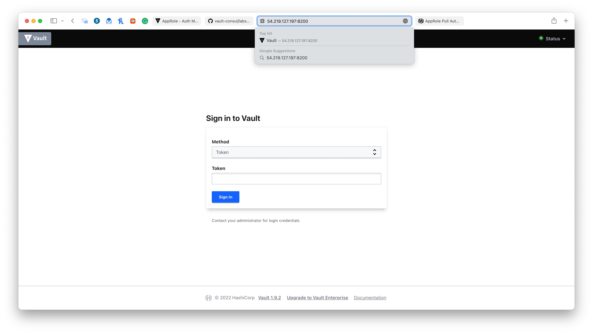

# Application integration

# Overview
Once you have learned the fundamentals of Vault, the next step is to start integrating your system with Vault to secure your organization's secrets.

The NodeJS  application in this demo leverages `node-vault` which provides lightweight client-side support for connecting to Vault in a distributed environment.

It is critical to protect data by encrypting it whether the data is in-transit or at-rest. However, creating a highly secure and sophisticated solution by yourself requires time and resources which are in demand when an organization is facing a constant threat.

Vault centralizes management of cryptographic services used to protect your data. Your system can communicate with Vault easily through the Vault API to encrypt and decrypt your data, and the encryption keys never have to leave the Vault.

## Access the WebUI
Load the Vault UI in a browser by accessing the VM public IP on port `8200`



## Enable KV Secret Backend
Enter your root token and hit “Sign In.” You’ll be greeted with the following screen.

[](images/vault-secret-backend.png)

Click `Enable new engine` and then select the `KV backend` and set the path to `secret`

We’ll use this backend to store our secrets and then later retrieve them in the Node.js demo.


## Configure AppRole Auth Method

We’ll now configure the AppRole auth method, which our Node.js application will use to retrieve the secrets from our key value backend.

Select `Access` from the top menu. Click `Enable New Method` and select `AppRole. Leave the settings default and click `Enable Method`.

## Create Policy for Secret Access

We’ll create a policy that allows read-only access to the KV secret backend.

Select `Policies` from the top menu and click `Create ACL Policy.

Enter name as `readonly-node`, and enter the following content for the Policy

```
path "secret/data/mysql/webapp" {
  capabilities = [ "read" ]
}
```

Following the principle of least privilege, this policy will only give read access to secrets at the specific path.

Hit `Create Policy` to save it. 

## Create AppRole for Node.js Application

We’re going to switch gears and use Vault CLI to finish setting up our demo.

Enter the Vault instance using `docker-compose`: 

```
docker-compose exec vault bash
```

Setup environment variables 
```
export VAULT_ADDR=http://localhost:8200
export VAULT_TOKEN=<your root token>
```

Now let’s create an AppRole and attach our policy to this role.

```
vault write auth/approle/role/node-app-role \
    token_ttl=1h \
    token_max_ttl=4h \
    token_policies=readonly-node

Success! Data written to: auth/approle/role/node-app-role
```

Each AppRole has a `RoleID` and `SecretID`, much like a username and password. The application can exchange this `RoleID` and `SecretID` for a token, which can then be used in subsequent requests.

## Get RoleID and SecretID

Now we’ll fetch the `RoleID` pertaining to the `node-app-role` via the following command:

```
vault read auth/approle/role/node-app-role/role-id
```

Next we'll fetch the `SecretID`:
```
vault write -f auth/approle/role/node-app-role/secret-id
```

Make sure you store these values somewhere, you'll need them for the Node.js application. 

## Create a Secret
As the last step of our setup process, we’ll create a secret key-value pair that we will access via our Node.js application.

```
vault kv put secret/mysql/webapp db_name="users" username="admin" password="passw0rd"
```

Now that we have our setup ready, we can proceed to our Node.js application.

## Manage Secrets via Node.js 

In this section we’ll see how to interact with Vault via Node.js and use the `node-vault` package to interact with our Vault server.

Install the following packages:
```
apk add nodejs npm vim
```

Enter the `/root` directory.
```
cd /root
```

Using `npm` install the `node-vault` package
```
npm install node-vault
```

Before we begin, set the `ROLE_ID` and `SECRET_ID` environment variables to pass these values to the application.

```
export ROLE_ID=<role id fetched in previous section>
export SECRET_ID=<secret id fetched in previous section>
```

Now let’s write a simple Node application that outputs the secret values, attempts to delete a secret, but fails due to permissions.

Create `/root/index.js` with the following: 

```js
const vault = require("node-vault")({
  apiVersion: "v1",
  endpoint: "http://127.0.0.1:8200",
});

const roleId = process.env.ROLE_ID;
const secretId = process.env.SECRET_ID;

const run = async () => {
  const result = await vault.approleLogin({
    role_id: roleId,
    secret_id: secretId,
  });

  vault.token = result.auth.client_token; // Add token to vault object for subsequent requests.

  const { data } = await vault.read("secret/data/mysql/webapp"); // Retrieve the secret stored in previous steps.

  const databaseName = data.data.db_name;
  const username = data.data.username;
  const password = data.data.password;

  console.log({
    databaseName,
    username,
    password,
  });

  console.log("Attempt to delete the secret");

  await vault.delete("secret/data/mysql/webapp"); // This attempt will fail as the AppRole node-app-role doesn't have delete permissions.
};

run();
```

Execute the application and notice it outputs the secret data to the console. 

You will also see a permission denied error. 

```
node --no-warnings index.js
```

Output: 
```
bash-5.1# node --no-warnings index.js
{ databaseName: 'users', username: 'admin', password: 'passw0rd' }
Delete failed, permission denied
```

In this article we saw the importance of having a secret manager in a distributed systems architecture. We also learned to access Vault via Node.js applications, retrieve secrets, and interface with Vault via Web UI and CLI to configure it for our sample application.

# Congrats
